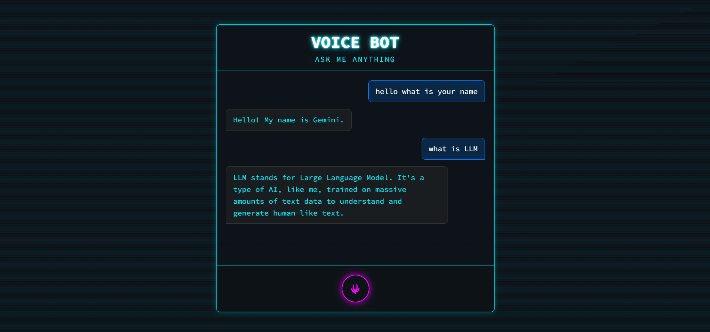

# Voice Bot 🤖

A simple, user-friendly web application featuring a voice-activated chatbot powered by the Google Gemini API. The bot is designed to answer questions with the specific persona of Gemini, providing a seamless voice-in, voice-out user experience.

[](https://vercel.com)

---

### Live Demo

**Test the live application here:** [voicebot-ashy.vercel.app](https://voicebot-ashy.vercel.app/)



## Features

-   **Voice-to-Text:** Utilizes the browser's built-in Web Speech API to transcribe user speech in real-time.
-   **AI-Powered Responses:** Integrates with the Google Gemini API to generate intelligent and context-aware answers.
-   **Streaming Responses:** Text from the AI is streamed token-by-token, creating a "live typing" effect.
-   **Themed UI:** A dark, monospaced interface with neon-glow effects and animations.
-   **Secure API Key Handling:** Employs a serverless function on Vercel to protect the Gemini API key.
-   **Text-to-Speech:** The bot speaks its generated responses back to the user for a hands-free experience.

## Technology Stack

-   **Frontend:** HTML5, CSS3, JavaScript (ES6+)
-   **AI Model:** Google Gemini API (`gemini-1.5-flash`)
-   **Backend:** Node.js Serverless Function
-   **Deployment:** Vercel

## How It Works

1.  **Voice Input:** The user clicks the microphone button, and the browser's `SpeechRecognition` API captures their question.
2.  **API Request:** The frontend sends this text to a serverless backend function at `/api/generate`.
3.  **Secure Backend Processing:** The Vercel function securely accesses the `GEMINI_API_KEY` from its environment variables and sends a request to the Google Gemini API.
4.  **AI Generation & Streaming:** Gemini streams the response back to the serverless function, which immediately relays it to the frontend.
5.  **Live Display & Voice Output:** The frontend displays the text as it arrives and, once complete, uses the browser's `SpeechSynthesis` API to speak the answer out loud.

## Local Development Setup

1.  **Prerequisites:**
    -   [Node.js](https://nodejs.org/) (LTS version recommended)
    -   [Git](https://git-scm.com/)

2.  **Clone the Repository:**
    ```bash
    git clone https://github.com/sairohitha-balam/Voicebot.git
    cd Voicebot
    ```

3.  **Install Dependencies:**
    ```bash
    npm install
    ```

4.  **Set Up Environment Variables:**
    -   Create a file named `.env.local` in the root of the project.
    -   Add your Gemini API key: `GEMINI_API_KEY="YOUR_API_KEY_HERE"`

5.  **Run the Development Server:**
    ```bash
    npm install -g vercel # Install Vercel CLI globally
    vercel dev # Start the local development server
    ```

## Future Scope

This project provides a solid foundation for a more advanced conversational AI assistant. Potential future enhancements include:

* **Conversational Memory:** Upgrade the backend to remember the last few turns of the conversation for more natural follow-up questions.
* **Function Calling & Tool Use:** Integrate external APIs to give the bot real-world capabilities, like fetching the live weather from a weather API.
* **Personalization:** Allow users to choose different voices, speaking rates, or even bot personalities by dynamically altering the system prompt.
* **"Wake Word" Activation:** Implement a "Hey Gemini" wake word to activate the bot without needing to click a button.
* **Multilingual Support:** Leverage the Gemini API's multilingual capabilities to allow users to converse in different languages.
* **User Authentication:** Add a login system to save conversation histories and user preferences across sessions.
